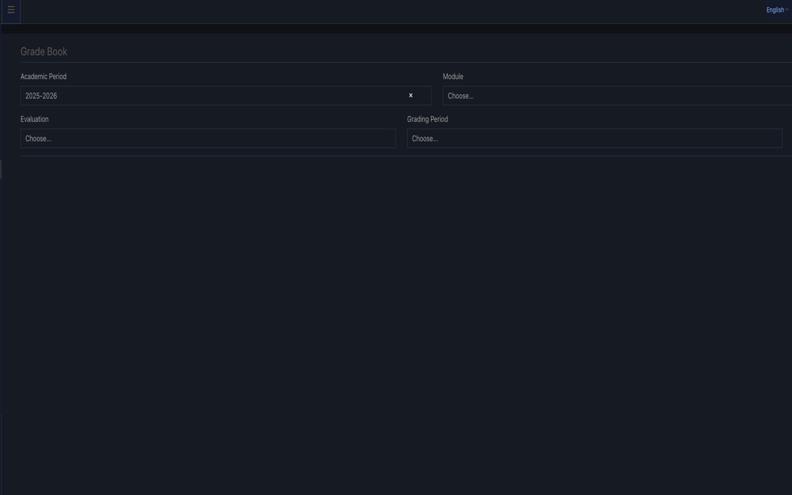

# MC-Class Dark Theme (Tampermonkey)

Dark theme userscript for `mc-class.gr`.

## Install

1. Install Tampermonkey extension in your browser.
2. Open `mc-class-dark.user.js`.
3. Click **Install** in Tampermonkey.
4. Visit `https://mc-class.gr` and refresh (`Cmd+Shift+R`).

## What it changes

- Applies dark backgrounds and high-contrast text
- Patches common mc-class blocks (`LessonBox`, `AccordionCard`, notifications, absences, etc.)
- Darkens Select2 dropdowns and pagination links
- Replaces `NoPhoto.jpg` placeholders with a dark placeholder image

## Files

- `mc-class-dark.user.js` — the userscript

## Version
- 0.1.3

## Notes

- If a page element still looks off, inspect its class/id and add it to the script selectors.
- This script is tailored for `mc-class.gr` and may need updates if site HTML changes.

## License

See [LICENSE](LICENSE).

## Changelog

See [CHANGELOG.md](CHANGELOG.md).

## Support

For issues, use [GitHub Issues](https://github.com/ek-mc/mc-class-dark-tampermonkey/issues).

